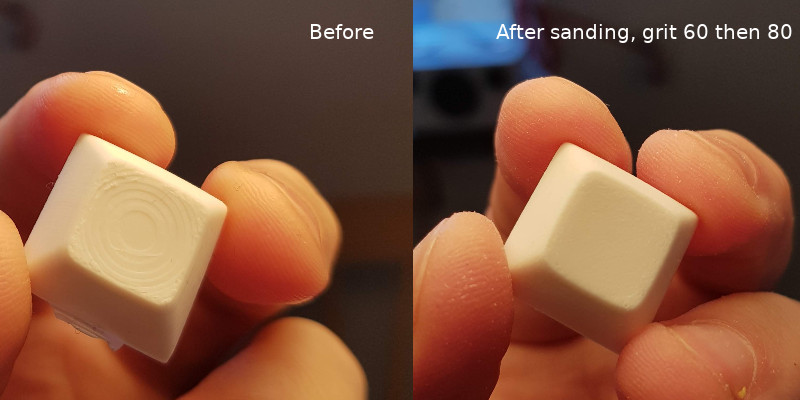

# dsa1u
A copy of the keyboard keycap format DSA, one unit.

This design was made from measurements on a DSA keycap set from [KBDfans](kbdfans.cn).

## Provided parts

- DSA1u: clean DSA design
- DSA1u w cross support: as above, with print support for the stem. Without these, the stems tends to fall off or rotate during a 3d print.
- DSA1u w cross and tab: as above, with a tab that allows for sliding a tool to remove from the print bed, without damaging the keycap. Useful for printing on a glass surface with glue, for example.
- Stem: the stem alone. Useful to create other keycaps. The stem might be too high as of today.
- Simplified DSA1u: DSA design but filled in and with a flat top surface. Useful for placing keycaps in a keyboard design, aligning the keycap tops as required rather than the switches themselves.

Parts provided as STL and STEP.

## Source

[Design made](https://cad.onshape.com/documents/56f37d767abc843c660870b6/w/7ff8f3d0b5ec233b9b7f22bd/e/9a344fa2dbf00a6281f7f5c9) with [Onshape](https://www.onshape.com/), 3D CAD in a browser.

## Printing

I have only tested printing in ABS, with layer height 0.06 mm and Ultimaker 2+ with 0.25 mm nozzle.

Acetone vapor bath alone did not give satisfactory results, softening the edges too much before smoothing out the print staircase on the top surface.

Sanding with 60 then 80 grit gave great results in shape and structure.

Some prints have a rotation of the stem. I think they come from the time when the support cross was too thin. This is depending on the printer, your mileage may vary.
